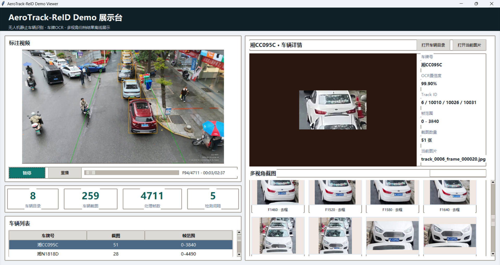
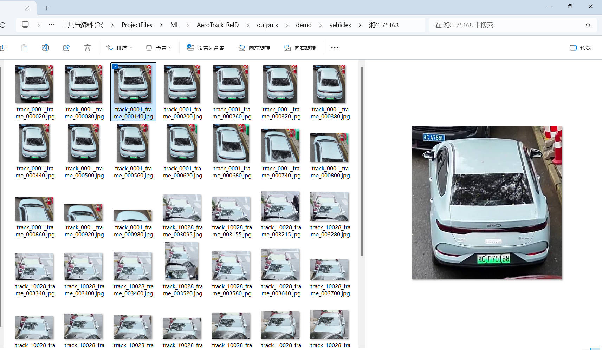

# AeroTrack-ReID

面向 4K 无人机往返视频的辅路静止车辆检测、车牌识别与多视角归档 Demo，提供 Windows 桌面展示界面。

## 项目简介

输入为无人机沿辅路前进、180° 调头后返程的视频。项目识别辅路中静止停放的车辆，保存原始截图，识别车牌，并将同一车辆在不同飞行阶段的截图归档到同一个车牌目录。

- 输入：原始 4K 视频、分段 ROI 标定配置、预训练模型。
- 输出：标注视频、车辆及车牌截图、结果摘要、OCR 调试记录、外观一致性审查记录。
- 展示：Tkinter 桌面窗口，支持视频播放与跳转、车牌检索、多视角浏览、图片缩放与拖动。
- 运行性质：离线推理与结果展示，不包含模型训练或微调。

原视频约 2 分 37 秒。针对该视频，经自动识别与人工复核补充，已完成 8 辆目标车辆的车牌与正反视角归档。此结果包含人工辅助，不代表未经干预的识别准确率。

技术说明参考 [项目文档.docx](项目文档.docx)，以下以当前代码和配置为准。

## 效果展示



*图 1：桌面界面展示标注视频、车辆信息与多视角截图。*



*图 2：按车牌归档同一车辆的去程与返程截图，示例为湘CF75168。*

## 启动方式

以下命令在 Windows PowerShell 中执行。先克隆仓库，并进入项目根目录：

```powershell
git clone https://github.com/GitHubNetizenS/AeroTrack-ReID-Demo.git
cd AeroTrack-ReID-Demo
```

仓库提供源码、配置和文档；原始视频、模型权重、模型缓存及 `outputs/` 运行结果不随 Git 上传，需要自行准备或由完整流水线生成。

### 方式一：仅展示已有结果

适合现场演示，不需要重新运行检测和 OCR，也不需要 GPU。

```powershell
conda create -n aerotrack_viewer python=3.10 -y
conda activate aerotrack_viewer
python -m pip install opencv-python numpy
python -c "import tkinter, cv2, numpy; print('Viewer dependencies OK')"
```

将已经生成的完整 `outputs/demo/` 目录放入项目中，至少确保下列资源存在：

```text
outputs/demo/
├── manifest.json
├── demo_annotated.mp4
└── vehicles/
    └── <车牌号>/
```

保留 `manifest.json` 引用的截图路径与目录结构。视频位置由清单内的 `config.io.output_video` 指定；从服务器迁移时，若清单使用绝对路径，需要改为本机有效路径，或采用 `outputs/demo/...` 项目相对路径。

```powershell
python demo_viewer.py
```

这是本地桌面窗口，不是网页。若提示缺少 `manifest.json`，请先准备结果目录或执行下方完整推理流程。

### 方式二：从原视频生成结果

#### 1. 安装依赖

```powershell
conda create -n aerotrack python=3.10 -y
conda activate aerotrack
python -m pip install --upgrade pip
python -m pip install -r requirements.txt
python -m pip check
```

当前依赖文件固定 `paddleocr==3.3.0`、`paddlepaddle==3.2.0`，OCR 模型配置为 `PP-OCRv4`。其余库尚未完整锁定版本，不能保证任意未来版本组合兼容；在已有可运行环境中可用 `python -m pip freeze` 记录具体版本。

默认车辆检测使用 `cuda:0`。使用 NVIDIA GPU 时，请按 [PyTorch 安装页面](https://pytorch.org/get-started/locally/)选择与设备、驱动匹配的 PyTorch / torchvision 安装命令，并检查：

```powershell
python -c "import torch; print('PyTorch:', torch.__version__); print('CUDA available:', torch.cuda.is_available())"
```

若没有可用 CUDA，将 `configs/demo_config.yaml` 中的 `model.device` 改为 `cpu`；CPU 完整推理通常耗时较长。`ocr.device` 独立配置，当前为 `cpu`。

#### 2. 准备视频与模型

```powershell
New-Item -ItemType Directory -Force datas/video, models/weights | Out-Null
```

将未经本项目标注的原始视频放到 `datas/video/fly_part.mp4`，或修改 `io.video_path`。不要将含检测框与 `STATIC` 文字的输出视频作为 OCR 原始输入。

将官方 YOLO11l 检测权重放到 `models/weights/yolo11l.pt`。在可联网环境中，也可以通过 Ultralytics 加载命令获取权重：

```powershell
python -c "from ultralytics import YOLO; YOLO('models/weights/yolo11l.pt')"
```

ResNet50 使用 torchvision 的预训练权重，可提前下载到 PyTorch 缓存：

```powershell
python -c "from torchvision.models import resnet50, ResNet50_Weights; resnet50(weights=ResNet50_Weights.DEFAULT)"
python -c "import torch; print(torch.hub.get_dir())"
```

权重保存在上述缓存目录的 `checkpoints/` 下。PaddleOCR 首次初始化也可能下载模型；离线展示前应在实际推理环境完成模型准备。若 ResNet50 加载失败，程序会提示并退回 HSV 颜色直方图特征。

#### 3. 检查配置并标定 ROI

主配置文件为 [configs/demo_config.yaml](configs/demo_config.yaml)。重点检查：

| 配置 | 当前值 / 用途 |
| --- | --- |
| `io.video_path` | `datas/video/fly_part.mp4`，输入视频 |
| `model.weights_path` | `models/weights/yolo11l.pt`，车辆检测权重 |
| `runtime.detect_interval` | `5`，每隔 5 帧检测一次 |
| `runtime.start_frame` / `end_frame` | 调试与完整运行范围，帧号从 0 开始，结束帧不超过视频最后有效帧 |
| `runtime.output_scale` | `0.5`，仅缩放输出视频 |
| `filter.flight_segments` | 去程、调头、返程的范围与 ROI 关键帧 |
| `ocr.isolate_paddle_process` | `true`，隔离 OCR 底层崩溃 |
| `reid.merge_by_appearance` | `false`，关闭自动外观聚类归并 |

配置中的 `model.type: yolov8` 是传给 SAHI 的适配器名称，实际检测型号由 `yolo11l.pt` 决定。

当前分段与 ROI 仅适用于原示例视频。换用其他视频时需要重新标定，例如：

```powershell
python roi_calibrator.py --frame 0
python roi_calibrator.py --frame 1800
python roi_calibrator.py --frame 4315
```

按顺时针或逆时针点击辅路多边形顶点，按 Enter 将终端输出的坐标填写到对应的 `roi_keyframes`。同一飞行段内各关键帧应保持顶点数量、顺序和对应关系一致；去程、返程均需标定，调头段可设置 `action: suspend`。

#### 4. 运行与展示

初次验证可先将 `runtime.end_frame` 设为 `300`，确认输出后恢复完整范围。

```powershell
python run_demo.py
python demo_viewer.py
```

`run_demo.py` 先处理视频，再执行 OCR、结果归并、外观审查与导出。视频帧处理结束后仍需等待后处理完成；现场演示建议提前生成结果，只运行桌面窗口。

## 关键算法与实现

```text
原始视频逐帧读取
  → 每 5 帧进行 SAHI + YOLO11l 检测
  → 类别 / 尺寸 / 动态 ROI 过滤
  → 分段 BoT-SORT 跟踪与两阶段 IoU 兜底
  → 相机运动补偿 + 静止投票
  → 原始帧车辆截图
  → 车牌候选提取 + 图像预处理 + PaddleOCR 多帧投票
  → 车牌后处理与跨去返程归档
  → 外观一致性审查
  → 标注视频、结果清单与桌面展示
```

### 车辆检测与空间过滤

使用 COCO 预训练的 **YOLO11l**，由 **SAHI** 将检测帧切成 `1024×1024` 像素窗口，水平和垂直重叠比例均为 `0.2`。切片结果映射回原图并融合，保留 `car`、`bus`、`truck`（类别 ID 为 `2、5、7`）。SAHI 主要改善小目标可见性，不能直接等同于总推理加速；间隔帧检测用于减少检测次数。

ROI 由人工关键帧多边形线性插值得到，当前流程是**先检测、后 ROI 过滤**。重叠率定义为“检测框内属于 ROI 的面积 / 检测框面积”，当前最低值为 `0.2`；同时过滤置信度、面积和宽高比异常的检测框。输出视频缩放不影响从原始帧保存车辆截图。

### 短程跟踪与静止判定

复用 Ultralytics **BoT-SORT**，配置稀疏光流全局运动补偿，关闭其内置 ReID。有效飞行段逐帧更新跟踪器，未执行检测的帧传入空检测，并通过近期状态辅助渲染。BoT-SORT 无轨迹输出而有检测框时，启用自定义 **ByteTrack 风格两阶段 IoU 兜底**：高置信度框匹配或创建轨迹，低置信度框只补充匹配已有轨迹。该兜底不是完整 ByteTrack 复现。

静止判定使用稀疏光流与 RANSAC 估计全局仿射运动，将车辆中心映射到补偿后的参考图像坐标，比较历次位置残差。当前配置要求至少 4 次有效残差观测，并在最近最多 6 次中至少 3 次不超过 `45` 像素。这里的坐标是近似稳定图像坐标，不是经过标定的真实世界米制坐标。

### 车牌候选、增强与 OCR

从未绘制标注的原始帧中截取车辆，利用车身下部固定区域以及蓝、绿、黄车牌的 **HSV 颜色阈值候选**寻找车牌，结合面积、宽高比与位置过滤减少干扰。

候选图使用**双三次插值**放大（默认 2 倍、最长边限制 960 像素），并生成 **Lab 亮度通道 CLAHE** 增强版本。当前识别输入为 `raw` 与 `clahe` 两种版本。PaddleOCR 对同一 track 抽样截图识别，结合文本格式、置信度与多帧投票筛选结果；它是通用 OCR，并非专门训练的车牌网络。

默认每条 track 最多抽取 8 张车辆图用于 OCR，这不等于最终目录最多保存 8 张截图。子进程隔离用于保护主流程；候选识别失败或超时仍可能降低结果完整性，并不保证 OCR 成功。

### 跨视角归档与外观审查

调头阶段暂停跟踪，进入新的有效飞行段时重置跟踪器，因此去程、返程的同一车辆通常具有不同 track ID。最终以**车牌文本**为主要归并依据，结合近似文本后处理；冲突 track 仅归入明确 OCR 命中点附近的局部截图，减少相邻车辆混入。

使用预训练 **ResNet50** 去除分类层后提取 2048 维外观特征，不训练或微调。加载失败时使用 HSV 颜色直方图替代。当前开启外观一致性审查，低相似度结果写入 `appearance_review.csv` 供人工复核，不据此自动删除截图。代码提供 **DBSCAN** 外观聚类分支，但 `merge_by_appearance: false` 时不启用外观自动归并。

## 人工辅助与更换视频

当前配置保留了原视频的交付修正：车牌别名、已知车牌软匹配、track 归属覆盖以及人工框选补充截图。即使 `use_expected_plates: false`，`soft_expected_plate_matching: true` 仍会使用人工确认列表辅助纠错。

更换视频或评估纯自动结果时，除重新标定 ROI 外，应在原配置相应位置修改以下字段，不要将这段作为重复的顶层配置直接追加：

```yaml
supplemental_crops:
  enabled: false
  items: []
postprocess:
  use_expected_plates: false
  soft_expected_plate_matching: false
  expected_plates: []
  plate_aliases: {}
  manual_track_plate_overrides: {}
  default_plate_province: ""
  default_plate_city_letter: ""
  keep_unknown: true
```

若需要人工补充漏检车辆，可在图形环境执行：

```powershell
python manual_crop_calibrator.py --frame 4315 --track-id 90003
```

用两个对角点框选整辆目标车辆，将工具输出填写到 `supplemental_crops.items` 并启用该功能。可选的 `--plate` 参数提供人工身份提示；它不训练检测器，也不属于自动识别结果。

## 输出文件

| 路径 | 内容 |
| --- | --- |
| `outputs/demo/demo_annotated.mp4` | ROI、车辆框、track ID 与静止状态视频 |
| `outputs/demo/raw_crops/` | 原始车辆与车牌候选截图 |
| `outputs/demo/vehicles/<车牌号>/` | 同车多视角归档 |
| `outputs/demo/summary.csv` | 车辆 ID、track ID、车牌、置信度、帧范围与目录 |
| `outputs/demo/manifest.json` | 本轮参数与完整结果路径，桌面界面的数据入口 |
| `outputs/demo/ocr_debug.csv` | OCR 原始文本、候选与置信度记录 |
| `outputs/demo/appearance_review.csv` | 外观相似度与可疑截图审查记录 |

程序不会自动清空旧输出。复核本轮结果时以本轮清单列出的路径为准；重要结果应提前另行保留。

## 项目结构

```text
AeroTrack-ReID-Demo/
├── configs/demo_config.yaml    # 主配置与原视频标定
├── datas/video/                # 原始视频，本地准备
├── models/weights/             # 检测权重，本地准备
├── outputs/                    # 推理输出，不提交 Git
├── src/
│   ├── detector.py             # SAHI 检测与过滤
│   ├── tracker.py              # 跟踪与静止判定
│   ├── roi.py                  # ROI 插值与重叠计算
│   ├── ocr.py                  # 候选提取与 OCR 投票
│   ├── ocr_worker.py           # 隔离 OCR 推理
│   ├── postprocess.py          # 车牌纠错与归并
│   ├── reid.py                 # 外观特征与一致性审查
│   └── results.py              # 截图与结果写入
├── baseline_sahi_inference.py  # 配置读取与基线入口
├── demo_pipeline.py           # 完整推理流水线
├── run_demo.py                # 推理启动入口
├── demo_viewer.py             # Tkinter 桌面展示
├── roi_calibrator.py          # 关键帧 ROI 标定
├── manual_crop_calibrator.py  # 人工补充截图标定
├── 项目文档.docx               # 技术说明
├── AGENTS.md                  # 项目维护记录
├── requirements.txt           # 推理依赖
├── .gitignore                 # 本地资源忽略规则
└── README.md                  # 项目说明与启动步骤
```

## 算法参考

- [Ultralytics YOLO11](https://docs.ultralytics.com/models/yolo11/)
- [SAHI](https://github.com/obss/sahi)
- [BoT-SORT](https://github.com/NirAharon/BoT-SORT)
- [ByteTrack](https://github.com/ifzhang/ByteTrack)
- [PaddleOCR](https://github.com/PaddlePaddle/PaddleOCR)
- [torchvision ResNet50](https://docs.pytorch.org/vision/stable/models/generated/torchvision.models.resnet50.html)

第三方代码、模型权重的使用与分发遵循各自许可证。
